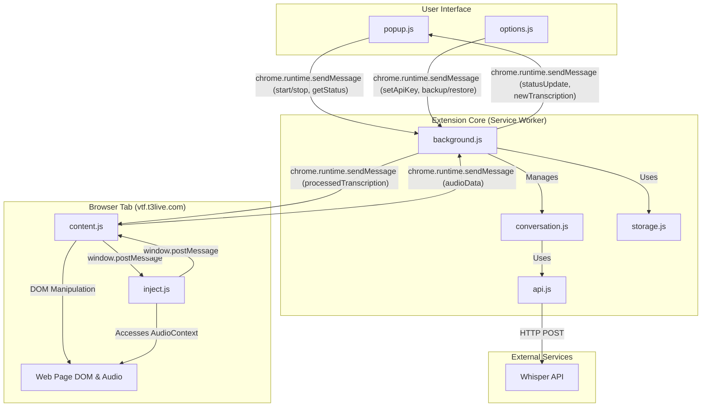

Here is a comprehensive technical documentation set for the **VTF Audio Transcriber** project, based on the current state of your local repository.

---

### **Section 1: High-Level Software Architecture**

**Goal:** To provide a clear and comprehensive overview of the system's architecture, enabling a reviewer to understand the fundamental design principles and how the components interact.

**1. System Overview**

The VTF Audio Transcriber is a Google Chrome extension designed to capture and transcribe real-time audio from the Virtual Trading Floor (VTF) web application. Its core functionalities include:
*   Automatically detecting and capturing audio streams from individual speakers within the VTF interface.
*   Buffering and processing this audio in real-time.
*   Sending processed audio segments to the OpenAI Whisper API for transcription.
*   Displaying the resulting transcriptions in a non-intrusive, draggable overlay on the VTF webpage.
*   Managing transcription state, speaker identification, and providing user controls for starting, stopping, and exporting sessions.

**2. Architectural Style**

The project employs a **layered, event-driven architecture**, which is characteristic of modern Chrome extensions (Manifest V3).

*   **Layered Design:** The architecture is segmented into distinct layers of responsibility:
    1.  **UI Layer (`popup.html`, `options.html`):** The user-facing controls for starting/stopping the service and configuring the API key.
    2.  **Content Injection Layer (`content.js`, `inject.js`):** The bridge between the extension and the target web page. It handles DOM manipulation and captures audio from the page's context.
    3.  **Core Logic/Service Layer (`background.js`):** The central service worker that manages state, orchestrates communication between all components, and handles the extension's core business logic.
    4.  **Data Processing Layer (`conversation.js`, `api.js`):** Responsible for the specialized tasks of buffering audio by speaker, formatting data for the API, and managing the API communication queue.

*   **Event-Driven Nature:** Communication between these layers is asynchronous and event-driven. Components do not call each other directly but pass messages (events) through well-defined channels (`chrome.runtime.sendMessage`, `window.postMessage`). This decouples the components, which is essential for a browser extension where different parts (like the popup and service worker) have independent lifecycles.

*   **Benefits & Drawbacks:**
    *   **Benefits:** This architecture provides strong security boundaries (isolating the page context from the extension context), promotes modularity, and is well-suited to the asynchronous, event-based nature of browser environments.
    *   **Drawbacks:** The main challenge is managing the complexity of asynchronous communication and state synchronization across multiple contexts, especially given the ephemeral nature of the Manifest V3 service worker. This was addressed by implementing a robust state management system and a service worker keep-alive mechanism.

**3. Component Diagram**

Here is a Mermaid.js diagram illustrating the system's major components and their relationships.

*   **Component Responsibilities:**
    *   `popup.js`: Provides primary user controls (start, stop) and displays real-time session metrics.
    *   `options.js`: Manages API key configuration and session data backup/restore.
    *   `content.js`: Injected into the VTF page. Renders the transcription overlay and acts as a message broker between `inject.js` and `background.js`.
    *   `inject.js`: Injected into the page's direct context. Accesses the Web Audio API to capture audio from `<audio>` elements.
    *   `background.js`: The central service worker. Manages the application state, handles all inter-component communication, and orchestrates the entire transcription process.
    *   `conversation.js`: A stateful processor that buffers audio per speaker, determines when a segment is complete, and manages transcription segments.
    *   `storage.js`: An abstraction layer for all interactions with `chrome.storage`, managing both persistent and session state.
    *   `api.js`: Handles all communication with the OpenAI Whisper API, including request queuing, retries, and audio format conversion.

**4. Data Flow**

*   **Audio Capture & Transcription Flow:**
    1.  `inject.js` uses a `MutationObserver` to detect new `<audio>` elements on the page.
    2.  It uses the Web Audio API to create an `AudioWorkletNode` that captures audio from the element's stream.
    3.  The worklet down-samples the audio to 16kHz, chunks it, and posts the raw `Float32Array` data to `content.js` via `window.postMessage`.
    4.  `content.js` forwards this audio chunk to `background.js` via `chrome.runtime.sendMessage`.
    5.  `background.js` passes the chunk to the `ConversationProcessor` (`conversation.js`).
    6.  The processor buffers the audio for the specific speaker. When a segment is ready (after 5 seconds or a pause), it's sent to `api.js`.
    7.  `api.js` converts the audio to WAV format, queues the request, and sends it to the Whisper API.
    8.  Upon receiving the transcribed text, `background.js` sends the completed segment to `content.js` for display in the overlay UI.

*   **Start Capture Flow (User Interaction):**
    1.  User clicks "Start Recording" in the popup UI (`popup.js`).
    2.  The popup sends a `{ "type": "startCapture" }` message to `background.js`.
    3.  `background.js` updates its state to `isCapturing = true`, initializes the `ConversationProcessor`, and starts the service worker keep-alive mechanism.
    4.  `background.js` then broadcasts a `{ "type": "start_capture" }` message to all active VTF content scripts.
    5.  `content.js` receives the message and posts a `VTF_START_CAPTURE` message to `inject.js`, which enables the audio capture logic.

**5. Technology Stack**

*   **Languages:** JavaScript (ES6 Modules), HTML5, CSS3
*   **Core Browser APIs:**
    *   Web Audio API: For capturing and processing audio in real-time.
    *   `AudioWorklet`: For efficient, low-latency audio processing off the main thread.
    *   Chrome Extension APIs (`chrome.runtime`, `chrome.storage`, `chrome.tabs`): The fundamental toolkit for the extension's operation.
*   **External Services:**
    *   OpenAI Whisper API: The third-party service used for speech-to-text transcription.
*   **Build Tool:**
    *   `make`: A simple command-line utility for cleaning and packaging the extension files into the `dist/` directory. No bundling or transpilation is performed.

**6. Architectural Decisions**

1.  **Use of `inject.js` for Audio Capture:**
    *   **Context:** Content scripts operate in an isolated world and cannot directly access JavaScript variables or functions from the web page they are injected into. Accessing an `<audio>` element's `MediaStream` for the Web Audio API requires being in the page's direct execution context.
    *   **Decision:** A dedicated `inject.js` script is dynamically injected into the web page's DOM. This script runs in the page's main world, giving it the necessary access to capture the audio stream. It communicates back to the sandboxed `content.js` using `window.postMessage`.
    *   **Reasoning:** This is the standard, secure pattern for achieving this level of page interaction, preventing the extension's core logic from being directly exposed to the web page while still gaining the access needed.

2.  **Stateful `ConversationProcessor` Module:**
    *   **Context:** The transcription logic is complex. It needs to handle multiple simultaneous speakers, buffer audio chunks, decide when a "sentence" or segment is complete based on timing, and associate transcriptions back to the correct speaker.
    *   **Decision:** All this stateful logic was encapsulated within the `ConversationProcessor` class (`conversation.js`) instead of being placed directly in the `background.js` script.
    *   **Reasoning:** This separation of concerns makes the codebase significantly more maintainable, readable, and testable. `background.js` becomes a simpler message router and lifecycle manager, while `conversation.js` handles the complex domain logic of a conversation.

3.  **Robust Service Worker Management:**
    *   **Context:** Manifest V3 service workers can be terminated by Chrome after just 30 seconds of inactivity to conserve resources. An active transcription session could last for hours, requiring the service worker to stay alive. Furthermore, if the worker does terminate or the extension is updated, the state can be lost, and connections to content scripts are severed.
    *   **Decision:** A multi-faceted system was implemented in `background.js` and `content.js`:
        *   A "keep-alive" `setInterval` pings a lightweight Chrome API every 25 seconds during active capture.
        *   A "health check" system periodically ensures communication channels are open.
        *   An "auto-recovery" mechanism was built to re-establish connections and re-initialize the capture process without requiring a manual page refresh from the user.
    *   **Reasoning:** This creates a resilient, enterprise-grade extension that can handle the limitations of the Manifest V3 lifecycle, providing a seamless user experience during long-running sessions.

---

### **Section 2: Detailed Chrome Implementation Analysis**

**Goal:** To document the specific implementation details of the Chrome-related features, focusing on the structure, functionality, and security of the Chrome extension.

**1. `manifest.json` Breakdown**

*   `manifest_version`: **3** - Specifies the use of the latest, most secure Chrome extension platform.
*   `name`, `version`, `description`, `icons`: Standard metadata for identifying the extension.
*   `content_scripts`: Defines that `content.js` should be injected into all pages matching `*://vtf.t3live.com/*`. `run_at: "document_idle"` ensures the page is fully loaded before the script runs.
*   `permissions`:
    *   `storage`: Required to use the `chrome.storage` API for persisting the user's API key and session data.
    *   `activeTab`: While not strictly required for the final implementation, it's a good practice to have for future features and is a permission that doesn't trigger a warning.
*   `host_permissions`: `https://api.openai.com/*` is explicitly requested to allow the extension to make `fetch` requests to the OpenAI API for transcription. This is a Manifest V3 requirement.
*   `background`: Configures `background.js` as the service worker. `type: "module"` enables the use of ES6 modules (`import`/`export`).
*   `action`: Defines `popup.html` as the UI to show when the user clicks the extension icon in the toolbar.
*   `options_page`: Defines `options.html` as the page for user configuration.
*   `web_accessible_resources`: Securely exposes `vtf-audio-processor.js` and `inject.js` *only* to the matched VTF website, allowing `content.js` to inject them into the page.
*   `content_security_policy`: Enforces a strict security policy for extension pages (`popup.html`, `options.html`), preventing the execution of inline scripts and restricting resource loading to the extension's own package (`'self'`).

**2. Core Components Deep Dive**

*   **Background Script (`background.js`):**
    *   **Role:** This is the extension's central hub. It is a non-terminating (during active use) script that manages all application state.
    *   **Processes:** It listens for messages from all other components. It initializes and owns the `ConversationProcessor` instance, which holds the audio buffers and transcription data. It also manages the service worker's own lifecycle with the keep-alive and health-check mechanisms.
    *   **Interactions:** It's the only component that directly interacts with `storage.js` and `api.js`. It receives audio from `content.js`, sends it for processing, and forwards the results back to the UI (`popup.js` and `content.js`).

*   **Content Scripts (`content.js`):**
    *   **Target:** It runs on `*://vtf.t3live.com/*`.
    *   **Functionality:**
        1.  **DOM Interaction:** It creates and manages the draggable transcription overlay UI, injecting it directly into the page's DOM.
        2.  **Message Brokering:** It acts as a secure bridge. It listens for `window.postMessage` events from `inject.js` (containing audio data) and forwards them to the background script via `chrome.runtime.sendMessage`. It also listens for messages from the background script (like new transcriptions or health checks) and acts on them.
        3.  **Auto-Recovery:** It contains logic to detect when its connection to the background script is lost (an "invalidated context") and can attempt to re-initialize the connection without a page refresh.

*   **Popup/UI (`popup.js`/`popup.html`):**
    *   **UI:** The popup displays the current recording status ("Recording" / "Stopped"), real-time metrics (number of speakers, number of transcriptions), and a view of the most recent transcription.
    *   **Actions:** It provides the primary "Start" and "Stop" buttons, along with "Copy" and "Export" functionality.
    *   **Logic:** Its logic is stateless. On opening, it requests the current status from `background.js`. All button clicks simply send a message to the background script to perform the action. It does not contain any core business logic itself.

**3. Communication and State Management**

*   **Communication:**
    *   **Page to Extension (`inject.js` -> `content.js` -> `background.js`):** This is a two-step process for security.
        *   `inject.js` sends raw audio data via `window.postMessage({ type: 'VTF_AUDIO_DATA', ... })`.
        *   `content.js` listens for these specific messages and securely forwards them using `chrome.runtime.sendMessage({ type: 'audioData', ... })`.
    *   **Extension to UI (`background.js` -> `popup.js` / `content.js`):** The background script sends messages like `{ type: 'statusUpdate', ... }` or `{ type: 'processedTranscription', ... }` to the UI components, which listen and update their DOMs accordingly.

*   **State Management:**
    *   `chrome.storage.local`: Used for data that must persist permanently across browser sessions. The primary use case is storing the user's **OpenAI API Key**.
    *   `chrome.storage.session`: Used for data that should persist only as long as the browser is open but needs to survive service worker restarts. It is used to store the state of the `ConversationProcessor` (audio buffers, completed segments). This is more performant than `local` storage as it is stored in-memory.
    *   The `storage.js` file acts as a dedicated module to handle all `get` and `set` operations for both storage types, providing a clean API for the rest of the application.

**4. Security and Privacy**

*   **Potential Implications:**
    *   The extension captures audio from the browser tab, which could be sensitive.
    *   This audio is sent to a third-party (OpenAI) for processing.
    *   The user's OpenAI API key, a secret, is stored by the extension.
*   **Mitigation Measures:**
    *   **Minimal Permissions:** The extension requests a minimal, necessary set of permissions.
    *   **Specific Host Permissions:** Network requests are restricted *only* to `api.openai.com`.
    *   **Secure Storage:** The API key is stored in `chrome.storage.local`, which is isolated to the extension and more secure than `localStorage`.
    *   **Secure Communication:** The use of `content.js` as a message broker prevents the web page from directly interacting with the extension's core logic.
    *   **Strict Content Security Policy (CSP):** The manifest enforces a strong CSP (`script-src 'self'`), which prevents cross-site scripting (XSS) attacks by disallowing the loading of scripts from any location other than the extension's own package. All inline event handlers (`onclick`) have been removed in favor of `addEventListener` to comply with this.

---

### **Section 3: Audio Capture Functionality**

**Goal:** To provide a detailed explanation of how audio is captured, processed, and managed within the application.

**1. Audio Capture Initiation**

Audio capture is not initiated directly by the user requesting microphone access. Instead, the extension captures audio that the browser is already playing from the VTF web application.

*   An `inject.js` script runs a `MutationObserver` that watches the page's DOM.
*   When VTF adds an `<audio id="msRemAudio-...">` element to the page for a new speaker, the observer detects it.
*   The script then grabs that element's `srcObject` (which is a `MediaStream`) to begin the capture process for that specific speaker.
*   This entire system is toggled on or off when the user clicks the "Start"/"Stop" button in the extension popup.

**2. Audio Stream Handling**

*   Once a `MediaStream` is obtained, it is processed in real-time using the **Web Audio API**.
*   In `inject.js`, an `AudioContext` is created. The `MediaStream` is piped into an `AudioWorkletNode`.
*   The `AudioWorkletNode` executes the code in `vtf-audio-processor.js` on a separate, high-priority audio thread, which is ideal for low-latency processing.
*   **Processing Steps in the Worklet:**
    1.  The audio is received as a `Float32Array`.
    2.  The worklet resamples the audio to the 16kHz sample rate required by the Whisper API.
    3.  It performs basic Voice Activity Detection (VAD) by analyzing audio energy levels to discard purely silent chunks.
    4.  The processed audio chunks are posted back to `inject.js`, which then sends them through the communication chain.

**3. Recording and Storage**

*   **In-Memory Buffering:** The system does not "record" audio to a file. Instead, it buffers audio chunks in memory. The `ConversationProcessor` in `background.js` maintains a JavaScript `Map`, where each key is a speaker's unique stream ID and the value is an object containing an array of their audio chunks.
*   **Audio Format:** When a segment is ready for transcription, the raw `Float32Array` chunks are concatenated and converted into the **WAV (Waveform Audio File Format)**. This conversion happens in the `api.js` module just before the data is sent to OpenAI.
*   **Storage:** The audio data is only stored temporarily in the `speakerBuffers` map. Once a segment is transcribed, the corresponding audio buffer is cleared from memory. Only the resulting text transcription is stored persistently (in `chrome.storage.session`).

**4. Error Handling and Permissions**

*   **Permissions:** Since the extension captures audio being played by the page, it does not need to request microphone permission from the user via `navigator.mediaDevices.getUserMedia`. The user implicitly grants permission by using the VTF site.
*   **Error Handling:**
    *   The system handles cases where an `<audio>` element's stream is not immediately available by listening for `play` and `loadedmetadata` events.
    *   The `background.js` and `content.js` scripts have robust error handling for "extension context invalidated" errors, triggering an automatic recovery process instead of requiring a manual page refresh.
    *   The API communication in `api.js` includes a retry mechanism with exponential backoff to handle transient network errors or API failures.

---

### **Section 4: Configurations and Settings**

**Goal:** To document all user-configurable settings and internal application configurations, including how they are managed and stored.

**1. User-Facing Settings**

| Setting Name | Key | Description | Default Value | Storage Location |
| :--- | :--- | :--- | :--- | :--- |
| OpenAI API Key | `openaiApiKey` | The user's secret key for authenticating with the OpenAI Whisper API. | `null` | `chrome.storage.local` |
| Session Backup | (File download) | The user can back up their entire session's transcriptions to a JSON file. | N/A | Local user filesystem |
| Session Restore | (File upload) | The user can restore a previously backed-up session from a JSON file. | N/A | Local user filesystem |

**2. Application Configuration**

These constants are found throughout the codebase and define key operational parameters.

| Constant | Value | Location | Description |
| :--- | :--- | :--- | :--- |
| `KEEP_ALIVE_INTERVAL` | 25000 | `src/background.js` | Interval (ms) to ping a Chrome API to keep the service worker alive. |
| `HEALTH_CHECK_INTERVAL`| 60000 | `src/background.js` | Interval (ms) for the background script to check its own health. |
| `SPEAKER_TIMEOUT_MS` | 1500 | `src/conversation.js` | The duration of silence (ms) after which a speaker's audio segment is considered complete and sent for transcription. |
| `MAX_SEGMENT_DURATION_S`| 5 | `src/conversation.js` | The maximum duration of an audio segment (seconds) before it's sent for transcription, even if the speaker is still talking. |
| `MAX_FILE_SIZE_MB` | 24 | `src/api.js` | The maximum size (MB) of a WAV file to be sent to the OpenAI API (OpenAI's limit is 25MB). |
| `WHISPER_API_URL` | `https://api.openai.com/v1/audio/transcriptions` | `src/api.js` | The endpoint for the Whisper API. |

**3. Environment Variables and Secrets**

*   **Environment Variables:** The project does not use any environment variables. All configuration is managed through the constants listed above.
*   **Secrets Management:** The only secret is the **OpenAI API Key**.
    *   It is **NOT** hardcoded.
    *   The user must manually enter it on the extension's Options page (`options.html`).
    *   Upon saving, the key is sent to the background script and stored securely in `chrome.storage.local`. It is only loaded into memory in the background script when needed for an API call.

**4. Build and Deployment Configuration**

The project uses a `Makefile` for its build process.

*   **Build Process (`make dist`):**
    1.  The `dist/` directory is removed if it exists (`make clean`).
    2.  A new, empty `dist/` directory is created.
    3.  All necessary files and directories (`manifest.json`, `src/`, `icons/`) are copied directly into the `dist/` directory.
    4.  The final `dist` directory is a complete, unpackaged Chrome extension ready to be loaded into Chrome for testing or zipped for submission to the Chrome Web Store.
*   **No Environment-Specific Builds:** The build process is simple file copying. There is no transpilation (e.g., Babel), bundling (e.g., Webpack), or separate configuration for `development` vs. `production` environments. This is suitable for a vanilla JavaScript project of this scale.